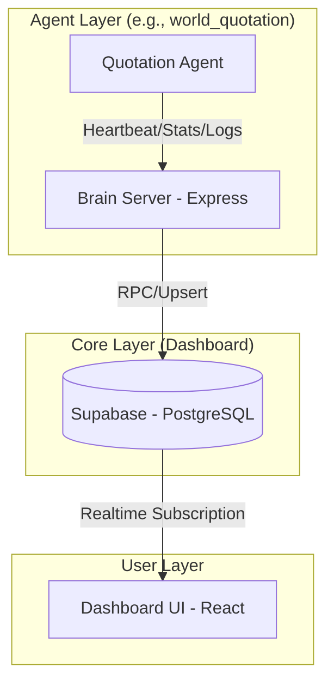
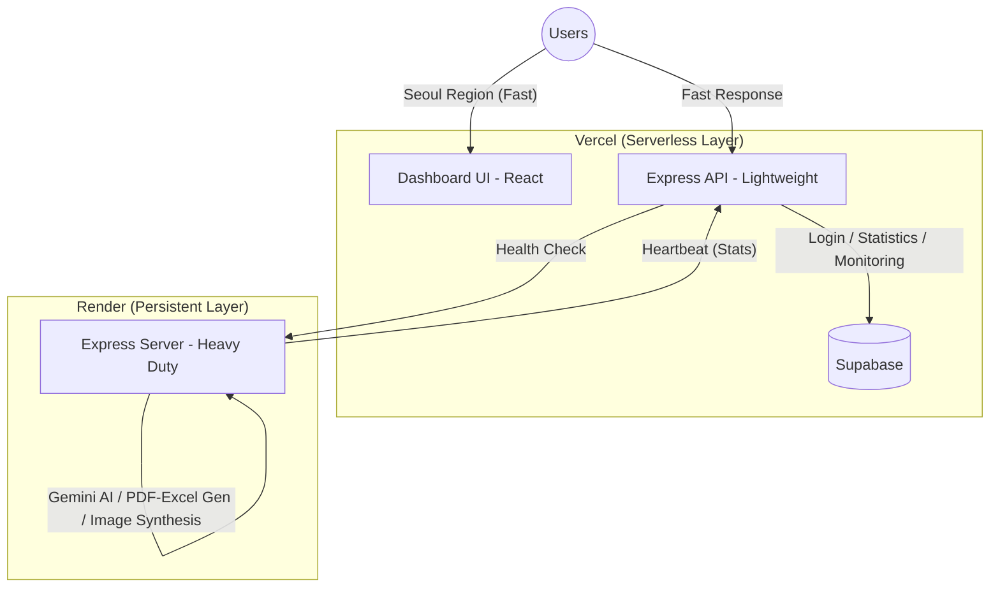

# 🧠 Agent Hub Architecture & Integration Guide

이 가이드라인은 **Quotation Agent(견적 에이전트)**와 **Dashboard Brain(대시보드 허브)** 간의 작동 방식, 아키텍처 구조, 그리고 새로운 에이전트를 추가할 때 고려해야 할 확장성 및 최적화 원칙을 정리한 문서입니다.

---

## 🏗️ 1. 전체 시스템 구조 (High-Level Architecture)

시스템은 크게 세 개의 레이어로 구성됩니다: **Agent (발생원)**, **Brain Server (중계 및 처리)**, **Supabase (저장 및 실시간 전파)**.



---

## 🛠️ 2. 컴포넌트별 상세 매핑

### 🔹 1) Frontend (Dashboard UI)
- **역할**: 에이전트 스테이터스 모니터링, 통계 시각화, 실시간 로그 스트리밍.
- **기술**: React + Vite, TailwindCSS (for UI), Recharts (for Charts).
- **데이터 흐름**: `AgentContext`에서 Supabase의 `agents` 및 `activity_logs` 테이블을 구독(Subscribe)하여 변경 사항을 실시간으로 감지하고 화면을 업데이트합니다.

### 🔹 2) Backend (Dashboard Brain Server)
- **역할**: 에이전트로부터 데이터를 수집하는 게이트웨이 및 상태 확인 엔진.
- **주요 엔드포인트**:
  - `POST /api/stats`: 모든 에이전트 통신(Heartbeat, API 통계, 작업 로그)을 단일 지점에서 수집.
  - `POST /api/stats/check-manual`: 특정 에이전트의 상태를 수동으로 핑(Ping)하여 건강 상태 확인.
- **최적화**: 비즈니스 로직(통계 집계 등)을 서버가 아닌 DB의 **RPC(Remote Procedure Call)**에 위임하여 서버 부하를 최소화했습니다.

### 🔹 3) Database (Supabase / PostgreSQL)
- **테이블 구조**:
  - `agents`: 에이전트 기본 정보, 상태, 누적/오늘의 통계.
  - `activity_logs`: 작업 및 하트비트 로그 기록.
  - `daily_stats` / `hourly_stats`: 차트 시각화를 위한 시계열 통계 데이터.
- **성능 최적화**: 
  - `update_agent_stats` RPC 함수를 통해 한 번의 요청으로 `agents`, `hourly_stats`, `daily_stats`, `api_breakdown` 테이블을 원자적(Atomic)으로 업데이트합니다.
  - 한국 시간(Asia/Seoul) 기준으로 자정 리셋 기능을 내부적으로 처리합니다.

---

## 📡 3. 통신 가이드라인 (Communication Protocol)

에이전트는 `statsService.js`를 통해 다음 세 가지 이벤트를 보고해야 합니다.

### ① 하트비트 (Heartbeat)
서버 시작 시 또는 정기적으로 에이전트의 존재를 알립니다.
```json
{
  "agentId": "agent-id",
  "apiType": "heartbeat",
  "baseUrl": "http://agent-address:port",
  "model": "gpt-4",
  "status": "online"
}
```

### ② API 통계 및 작업 트래킹 (Stats Tracking)
Gemini API 호출이나 특정 작업을 마친 후 성공 여부와 응답 속도를 보고합니다.
```json
{
  "agentId": "agent-id",
  "apiType": "api_call_type",
  "responseTime": 1200,
  "isError": false,
  "shouldCountApi": true,
  "shouldCountTask": true
}
```

### ③ 활동 로그 (Activity Log)
사용자 대면 액션(로그인, 견적 완료 등)을 실시간으로 전송합니다.
```json
{
  "agentId": "agent-id",
  "apiType": "activity_log",
  "logAction": "Login success: user@example.com",
  "logType": "success",
  "userName": "Injeon"
}
```

---

## 🚀 4. 확장성 및 호환성 고도화 설계 (Best Practices)

새로운 에이전트를 추가하거나 기능을 고도화할 때 다음 원칙을 준수해야 합니다.

### 1️⃣ 확장성 (Scalability)
- **Unique Agent ID**: 모든 에이전트는 독립적인 `agentId`를 가져야 하며, 대시보드 DB의 `agents` 테이블에 사전에 등록되어야 합니다.
- **Payload Agnostic**: 대시보드는 에이전트 내부 로직을 몰라도 됩니다. 오직 정의된 Payload 규격만 준수하면 어떤 종류의 에이전트(이미지 분석, 텍스트 요약 등)도 수용 가능합니다.

### 2️⃣ 호환성 (Compatibility)
- **Base URL 관리**: 대시보드에서 에이전트의 API를 역으로 호출(수동 리셋, 상태 체크 등)할 수 있도록 하트비트 시 `baseUrl`을 최신 상태로 유지해야 합니다.
- **Graceful Failure**: 대시보드 서버가 일시적으로 중단되더라도 에이전트의 핵심 비즈니스 로직(견적 생성 등)은 중단되지 않도록 비동기 또는 무시 가능한 에러 처리를 적용해야 합니다.

### 3️⃣ 성능 (Performance)
- **DB Push, Not Pull**: 대시보드가 수백 개의 에이전트를 매번 폴링(Polling)하는 대신, 에이전트가 이벤트 발생 시점에만 데이터를 Push하는 방식을 지향합니다.
- **Stat Batching**: 잦은 통계 업데이트가 부담될 경우, 일정 주기로 요청을 모아서 보낼 수 있도록 에이전트 사이드의 버퍼링 고려가 필요합니다.

### 4️⃣ 최적화 (Optimization)
- **Supabase Realtime 활용**: 굳이 소켓 서버를 직접 구축하지 말고 Supabase의 실시간 채널을 활용하여 프론트엔드 업데이트 로직을 단순화합니다.
- **RPC 집계**: 복잡한 통계 계산은 애플리케이션 서버가 아닌 PostgreSQL 내부 함수에서 처리하여 데이터 일관성을 보장합니다.

---

## ✅ 5. 신규 에이전트 추가 체크리스트

1. [ ] **DB 등록**: Supabase `agents` 테이블에 새 에이전트의 ID와 이름을 추가합니다.
2. [ ] **환경변수 설정**: 에이전트에 `DASHBOARD_API_URL`과 고유 `AGENT_ID`를 등록합니다.
3. [ ] **Service 이식**: `statsService.js`를 신규 에이전트에 복사하여 기본 통신 환경을 구축합니다.
4. [ ] **로그 포인트 삽입**: 핵심 로직(Entry point, Error catch, Completion)에 `trackApiCall`과 `sendActivityLog`를 호출합니다.
5. [ ] **Health Check 연동**: 에이전트 백엔드에 `/api/quote/health`와 같은 헬스 체크 엔드포인트를 구현하여 대시보드와 양방향 소통을 완성합니다.

---

## 🚢 6. 배포 아키텍처 (Deployment Architecture)

시스템은 **Vercel**과 **Render** 두 플랫폼을 전략적으로 활용하여 "가벼운 API 처리"와 "무거운 연산 작업"을 분리한 하이브리드 구조로 배포됩니다.

### 배포 구조도



### 플랫폼별 배포 전략

#### 1️⃣ Vercel (Serverless Functions)
- **핵심 파일**: `Dashboard/api/*`, `vercel.json`
- **관리 방식**: 요청 시에만 실행되는 서버리스 함수로 배포
- **주요 특징**:
  - **초저지연**: `regions: ["icn1"]` (서울) 설정으로 한국 사용자에게 50ms 미만의 빠른 응답
  - **관리 편의성**: 인프라 관리 불필요, 프론트엔드와 동일 도메인에서 API 제공
  - **비용 효율**: 트래픽이 없을 때 비용 거의 발생하지 않음
- **주요 임무**: 
  - 대시보드 로그인 및 권한 관리
  - 에이전트 통계 및 로그 데이터 수집
  - React 프론트엔드 정적 호스팅

#### 2️⃣ Render (Persistent Web Service)
- **핵심 파일**: `world_quotation/backend/render.yaml`
- **관리 방식**: 24시간 상시 구동되는 웹 서비스 인스턴스 (`npm start`)
- **주요 특징**:
  - **긴 실행 시간**: 타임아웃 제한 없이 몇 분이 걸리는 작업도 완료 가능
  - **상태 유지**: 서버가 항상 켜져 있어 대시보드의 헬스 체크(Health Check) 수신에 최적
  - **복잡한 라이브러리 지원**: `canvas`, `pdfkit`, `exceljs` 등 CPU 집약적 작업 안정적 처리
- **주요 임무**:
  - Gemini AI를 통한 상세 견적서 작성
  - 3D 가상 이미지 합성 및 복잡한 인포그래픽 생성
  - PDF/Excel 파일 생성 등 무거운 연산 작업

### 배포 플랫폼 선택 가이드

| 비교 항목 | Vercel (Lightweight API) | Render (Heavy Duty Server) |
| :--- | :--- | :--- |
| **적합한 작업** | 인증, 단순 CRUD, 짧은 통계 수집 | AI 연산, 이미지/파일 생성, 긴 비즈니스 로직 |
| **응답 속도** | **매우 빠름 (서울 리전 지원)** | 보통 (주로 해외 리전) |
| **실행 시간 제한** | 10~30초 (제한적) | **제한 없음** |
| **인프라 형태** | 서버리스 (Serverless) | 상시 구동 서버 (PaaS) |
| **비용 구조** | 요청당 과금 | 인스턴스 시간당 과금 |

### 배포 전략 권장사항

- **대시보드 핵심 기능**: Vercel 서울 리전에 배포하여 사용자 경험 극대화
- **에이전트 백엔드**: 작업 특성에 따라 선택
  - 가벼운 API 응답: Vercel 활용
  - 무거운 연산 작업: Render 활용
- **유연한 전환**: `render.yaml`과 `vercel.json`을 모두 유지하여 상황에 따라 플랫폼 전환 가능

---

> [!TIP]
> **확장 팁**: 만약 에이전트가 많아질 경우, 대시보드 서버는 단순 프록시 역할만 수행하고 에이전트가 Supabase에 직접 데이터를 `UPSERT` 하도록 변경하면 아키텍처를 더 얇게(Thin) 유지할 수 있습니다. (현재는 보안 및 필터링을 위해 Brain Server를 거치는 구조입니다.)
