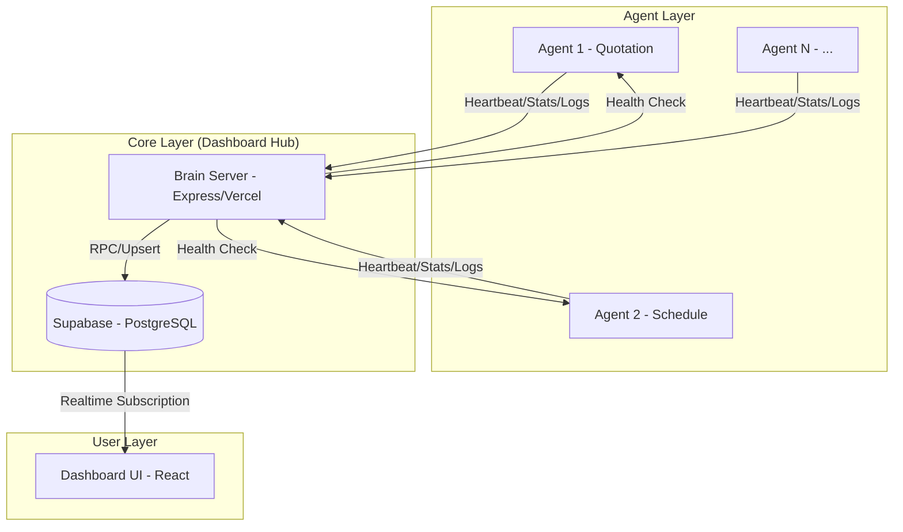
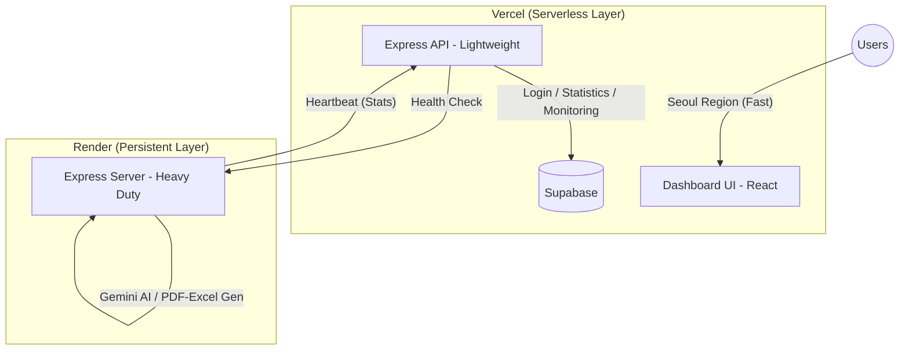

# Agent Integration Guide

Dashboard Hub와 새로운 Agent를 연동하기 위한 완전한 가이드입니다.

---

## CRITICAL RULES (반드시 준수)

```
1. Vercel Serverless에서 trackApiCall/sendActivityLog 호출 시 반드시 await 사용
   - await 없으면 함수 종료 후 요청이 취소됨
   - 로그가 DB에 저장되지 않는 #1 원인

2. base_url 끝에 슬래시(/) 금지
   - 올바름: https://wl-agent2.supersquad.kr
   - 잘못됨: https://wl-agent2.supersquad.kr/

3. api_breakdown에 등록된 api_type과 trackApiCall의 apiType 정확히 일치
   - 대소문자, 하이픈 모두 일치해야 함

4. Health endpoint는 /api/health 경로, GET 메소드, 5초 내 응답 필수

5. Frontend에서 body로 전달하는 파라미터는 Backend에서 반드시 추출해서 사용
   - Frontend: body: JSON.stringify({ userName })
   - Backend: const { userName } = req.body || {}
   - 누락 시 activity log에 사용자 정보 기록 안됨
   - 흔한 실수: Frontend만 수정하고 Backend는 안 받음!
```

---

## Quick Start (5분 연동)

**최소 요구사항만 빠르게 설정하려면:**

```bash
# 1. Database 설정 (Supabase SQL Editor)
INSERT INTO agents (id, name, client_id, status, base_url)
VALUES ('{AGENT_ID}', '{AGENT_NAME}', '{CLIENT_ID}', 'offline', '{BASE_URL}');

INSERT INTO api_breakdown (agent_id, api_type, today_count, total_count)
VALUES ('{AGENT_ID}', '{API_TYPE}', 0, 0);

# 2. Health endpoint 생성 (app/api/health/route.ts)
export async function GET() {
  return NextResponse.json({ status: 'ok' })
}

# 3. statsService 복사 (lib/services/statsService.ts)
# 4. AGENT_ID 상수 변경
# 5. API route에 await trackApiCall() 추가
# 6. Vercel 환경변수 설정 후 배포
```

상세 내용은 아래 섹션 참조.

---

## Placeholder Reference (변경 필요 항목)

| Placeholder | 설명 | 예시 |
|-------------|------|------|
| `{AGENT_ID}` | 에이전트 고유 ID | `agent-worldlocker-003` |
| `{AGENT_NAME}` | 에이전트 이름 | `납품일정 에이전트` |
| `{CLIENT_ID}` | 클라이언트 ID | `client-worldlocker` |
| `{BASE_URL}` | 배포 URL | `https://wl-agent2.supersquad.kr` |
| `{YOUR_AGENT_URL}` | 에이전트 URL (curl용) | `wl-agent2.supersquad.kr` |
| `{API_TYPE}` | API 타입 | `teams-read`, `ai-coach` |
| `{API_TYPE_1}`, `{API_TYPE_2}`, `{API_TYPE_3}` | 여러 API 타입 | `teams-read`, `teams-send`, `ai-coach` |
| `{CATEGORY}` | 에이전트 카테고리 | `schedule`, `quotation` |
| `{YOUR_DOMAIN}` | 회사 도메인 | `worldlocker` |

---

## 목차

1. [개요](#1-개요)
2. [사전 준비](#2-사전-준비)
3. [Step 1: Database 설정](#3-step-1-database-설정)
4. [Step 2: statsService 구현](#4-step-2-statsservice-구현)
5. [Step 3: Health Endpoint 구현](#5-step-3-health-endpoint-구현)
6. [Step 4: API Route에 Tracking 추가](#6-step-4-api-route에-tracking-추가)
7. [Step 5: Dashboard UI 수정](#7-step-5-dashboard-ui-수정)
8. [Step 6: 환경 변수 설정](#8-step-6-환경-변수-설정)
9. [Step 7: 배포 및 검증](#9-step-7-배포-및-검증)
10. [Troubleshooting](#10-troubleshooting)
11. [API Reference](#11-api-reference)

---

## 1. 개요

### 아키텍처 (Mermaid Diagram)



### 아키텍처 (Text Diagram)

```
┌─────────────────────────────────────────────────────────┐
│  Your Agent (Next.js / Express)                         │
├─────────────────────────────────────────────────────────┤
│  statsService.trackApiCall()                            │
│  statsService.sendActivityLog()                         │
│  /api/health endpoint                                   │
└──────────────────┬──────────────────────────────────────┘
                   │ POST https://hub.supersquad.kr/api/stats
                   ▼
┌──────────────────────────────────────────────────────────┐
│  Dashboard Hub API                                       │
│  - 통계 수집 및 저장                                      │
│  - Health Check 수행                                     │
└──────────────────┬───────────────────────────────────────┘
                   │
                   ▼
┌──────────────────────────────────────────────────────────┐
│  Supabase Database                                       │
│  - agents: 에이전트 상태/통계                             │
│  - api_breakdown: API 타입별 카운트                       │
│  - activity_logs: 활동 로그                              │
│  - daily_stats: 일일 통계                                │
└──────────────────────────────────────────────────────────┘
```

### 통신 방식

- **Agent → Dashboard**: 단방향 POST (Agent가 능동적으로 보고)
- **Dashboard → Agent**: Health Check만 수행 (GET /api/health)

---

## 2. 사전 준비

### 필요 정보

| 항목 | 예시 | 설명 |
|------|------|------|
| Agent ID | `agent-worldlocker-003` | 고유 식별자 (형식: `agent-{client}-{number}`) |
| Agent 이름 | `납품일정 에이전트` | Dashboard에 표시될 이름 |
| Client ID | `client-worldlocker` | 소속 클라이언트 ID |
| Base URL | `https://wl-agent2.supersquad.kr` | 배포된 Agent URL |
| Task Performance 항목 | `teams-read`, `teams-send`, `ai-coach` | 추적할 API 타입들 |

---

## 3. Step 1: Database 설정

### 3.1 agents 테이블에 레코드 추가

Supabase SQL Editor에서 실행:

```sql
-- 새 에이전트 등록
INSERT INTO agents (
    id,
    name,
    model,
    client_name,
    client_id,
    status,
    created_at,
    last_active,
    total_api_calls,
    today_api_calls,
    total_tasks,
    today_tasks,
    total_errors,
    today_errors,
    error_rate,
    avg_response_time,
    base_url
) VALUES (
    '{AGENT_ID}',                      -- 고유 ID (예: agent-worldlocker-003)
    '납품일정 에이전트',                  -- 표시 이름
    'gemini-2.0-flash',                -- 사용 모델
    '(주)월드락커',                      -- 클라이언트명
    'client-worldlocker',              -- 클라이언트 ID
    'offline',                         -- 초기 상태
    NOW(),
    NOW(),
    0, 0, 0, 0, 0, 0, 0, 0,
    'https://wl-agent2.supersquad.kr'  -- 배포 URL (끝에 / 없이)
);
```

### 3.2 api_breakdown 테이블에 Task Performance 항목 추가

```sql
-- Task Performance로 추적할 API 타입들 등록
INSERT INTO api_breakdown (agent_id, api_type, today_count, total_count)
VALUES
    ('{AGENT_ID}', '{API_TYPE_1}', 0, 0),
    ('{AGENT_ID}', '{API_TYPE_2}', 0, 0),
    ('{AGENT_ID}', '{API_TYPE_3}', 0, 0);
-- 예시: ('agent-worldlocker-003', 'teams-read', 0, 0)
```

### 3.3 필수 테이블 스키마 참고

<details>
<summary>agents 테이블 전체 스키마</summary>

```sql
CREATE TABLE agents (
    id TEXT PRIMARY KEY,
    name TEXT NOT NULL,
    model TEXT,
    client_name TEXT,
    client_id TEXT,
    status TEXT DEFAULT 'offline',      -- 'online' | 'offline'
    api_status TEXT DEFAULT 'unknown',  -- 'healthy' | 'error' | 'unknown'
    created_at TIMESTAMPTZ DEFAULT NOW(),
    last_active TIMESTAMPTZ,
    base_url TEXT,                      -- Health check용 URL (끝에 / 없이!)
    account TEXT,
    api_key TEXT,

    -- 통계 필드
    total_api_calls INTEGER DEFAULT 0,
    today_api_calls INTEGER DEFAULT 0,
    total_tasks INTEGER DEFAULT 0,
    today_tasks INTEGER DEFAULT 0,
    total_errors INTEGER DEFAULT 0,
    today_errors INTEGER DEFAULT 0,
    error_rate REAL DEFAULT 0,
    avg_response_time REAL DEFAULT 0,
    total_response_time INTEGER DEFAULT 0,
    response_count INTEGER DEFAULT 0,
    last_reset_date DATE DEFAULT CURRENT_DATE
);
```

</details>

<details>
<summary>activity_logs 테이블 스키마</summary>

```sql
CREATE TABLE activity_logs (
    id UUID PRIMARY KEY DEFAULT gen_random_uuid(),
    agent_id TEXT NOT NULL REFERENCES agents(id),
    action TEXT NOT NULL,              -- 로그 메시지
    type TEXT DEFAULT 'info',          -- 'info' | 'success' | 'error' | 'warning' | 'login' | 'heartbeat'
    status TEXT DEFAULT 'success',     -- 'success' | 'error'
    timestamp TIMESTAMPTZ DEFAULT NOW(),
    response_time INTEGER DEFAULT 0,
    user_name TEXT,
    product_type TEXT,                 -- 제품 타입 (선택)
    image_url TEXT                     -- 이미지 URL (선택)
);

-- 인덱스 (조회 성능 최적화)
CREATE INDEX idx_activity_logs_agent_id ON activity_logs(agent_id);
CREATE INDEX idx_activity_logs_timestamp ON activity_logs(timestamp DESC);
```

</details>

<details>
<summary>api_breakdown 테이블 스키마</summary>

```sql
CREATE TABLE api_breakdown (
    id SERIAL PRIMARY KEY,
    agent_id TEXT NOT NULL REFERENCES agents(id),
    api_type TEXT NOT NULL,            -- 'teams-read', 'ai-coach' 등
    today_count INTEGER DEFAULT 0,
    total_count INTEGER DEFAULT 0,
    UNIQUE(agent_id, api_type)
);
```

</details>

### 3.4 update_agent_stats RPC 함수

Dashboard Hub의 `/api/stats` 엔드포인트가 내부적으로 호출하는 함수입니다.
Agent 개발자가 직접 호출할 필요는 없지만, 디버깅 시 참고용으로 기록합니다.

```sql
-- Supabase에 이미 생성되어 있음 (참고용)
CREATE OR REPLACE FUNCTION update_agent_stats(
    p_agent_id TEXT,
    p_response_time INTEGER DEFAULT 0,
    p_is_error BOOLEAN DEFAULT FALSE,
    p_should_count_api BOOLEAN DEFAULT TRUE,
    p_should_count_task BOOLEAN DEFAULT TRUE
) RETURNS VOID AS $$
BEGIN
    UPDATE agents SET
        last_active = NOW(),
        today_api_calls = CASE WHEN p_should_count_api THEN today_api_calls + 1 ELSE today_api_calls END,
        total_api_calls = CASE WHEN p_should_count_api THEN total_api_calls + 1 ELSE total_api_calls END,
        today_tasks = CASE WHEN p_should_count_task THEN today_tasks + 1 ELSE today_tasks END,
        total_tasks = CASE WHEN p_should_count_task THEN total_tasks + 1 ELSE total_tasks END,
        today_errors = CASE WHEN p_is_error THEN today_errors + 1 ELSE today_errors END,
        total_errors = CASE WHEN p_is_error THEN total_errors + 1 ELSE total_errors END,
        total_response_time = total_response_time + p_response_time,
        response_count = response_count + 1,
        status = 'online'
    WHERE id = p_agent_id;
END;
$$ LANGUAGE plpgsql;
```

---

## 4. Step 2: statsService 구현

### 4.1 TypeScript 버전 (Next.js App Router용)

파일: `lib/services/statsService.ts`

```typescript
const AGENT_ID = '{AGENT_ID}'  // 여기에 Agent ID 입력 (예: 'agent-worldlocker-003')
const DASHBOARD_API_URL = process.env.DASHBOARD_API_URL || 'https://hub.supersquad.kr/api/stats'
const MODEL_NAME = process.env.GEMINI_MODEL || 'gemini-2.0-flash'

/**
 * API 호출 추적 - Dashboard Hub에 보고
 *
 * @param apiType - 추적할 API 타입 (예: 'teams-read', 'ai-coach')
 * @param responseTime - 응답 시간 (ms)
 * @param isError - 에러 여부
 * @param shouldCountApi - API 호출 카운트에 포함할지
 * @param shouldCountTask - Task 카운트에 포함할지
 * @param logMessage - 로그 메시지 (선택)
 * @param userName - 사용자 이름 (선택)
 * @param productType - 제품 타입 (선택, 예: 'locker', 'cabinet')
 * @param imageUrl - 관련 이미지 URL (선택)
 */
export async function trackApiCall(
  apiType: string,
  responseTime: number = 0,
  isError: boolean = false,
  shouldCountApi: boolean = true,
  shouldCountTask: boolean = true,
  logMessage: string | null = null,
  userName: string | null = null,
  productType: string | null = null,
  imageUrl: string | null = null
): Promise<{ success: boolean; error?: string }> {
  try {
    const payload = {
      agentId: AGENT_ID,
      apiType,
      responseTime,
      isError,
      shouldCountApi,
      shouldCountTask,
      model: MODEL_NAME,
      account: process.env.ACCOUNT_EMAIL || 'admin@{YOUR_DOMAIN}.com',
      apiKey: process.env.GEMINI_API_KEY
        ? `sk-...${process.env.GEMINI_API_KEY.slice(-4)}`
        : 'sk-unknown',
      logMessage,
      userName,
      productType,
      imageUrl,
    }

    const response = await fetch(DASHBOARD_API_URL, {
      method: 'POST',
      headers: { 'Content-Type': 'application/json' },
      body: JSON.stringify(payload),
    })

    if (!response.ok) {
      console.error(`[statsService] Failed to report stats: ${response.status}`)
    } else {
      console.log(`[statsService] Stats reported: ${apiType}`)
    }

    return { success: response.ok }
  } catch (error: any) {
    console.error(`[statsService] Dashboard unavailable: ${error.message}`)
    return { success: false, error: error.message }
  }
}

/**
 * 활동 로그 전송 - Dashboard Hub에 보고
 *
 * @param action - 로그 메시지 (예: 'User logged in')
 * @param logType - 로그 타입 ('info' | 'success' | 'error' | 'warning' | 'login')
 * @param responseTime - 응답 시간 (ms)
 * @param userName - 사용자 이름 (선택)
 */
export async function sendActivityLog(
  action: string,
  logType: string = 'info',
  responseTime: number = 0,
  userName: string | null = null
): Promise<{ success: boolean; error?: string; result?: any }> {
  if (!action) {
    console.error('[statsService] sendActivityLog: action is required')
    return { success: false, error: 'action parameter is required' }
  }

  try {
    const payload = {
      agentId: AGENT_ID,
      apiType: 'activity_log',
      logAction: action,
      logType: logType || 'info',
      responseTime: responseTime || 0,
      shouldCountApi: false,
      shouldCountTask: false,
      model: MODEL_NAME,
      account: process.env.ACCOUNT_EMAIL || 'admin@worldlocker.com',
      userName: userName || null,
    }

    const response = await fetch(DASHBOARD_API_URL, {
      method: 'POST',
      headers: { 'Content-Type': 'application/json' },
      body: JSON.stringify(payload),
    })

    if (!response.ok) {
      const errorText = await response.text().catch(() => 'Unknown error')
      console.error(`[statsService] Activity log failed: ${response.status}`)
      return { success: false, error: `HTTP ${response.status}: ${errorText}` }
    }

    const result = await response.json().catch(() => ({}))
    console.log(`[statsService] Activity log sent: "${action}"`)
    return { success: true, result }
  } catch (error: any) {
    console.error(`[statsService] Dashboard unavailable: ${error.message}`)
    return { success: false, error: error.message }
  }
}

/**
 * Heartbeat 전송 - 서버 시작 시 호출
 */
export async function sendHeartbeat(baseUrl: string): Promise<void> {
  try {
    const response = await fetch(DASHBOARD_API_URL, {
      method: 'POST',
      headers: { 'Content-Type': 'application/json' },
      body: JSON.stringify({
        agentId: AGENT_ID,
        apiType: 'heartbeat',
        baseUrl,
        shouldCountApi: false,
        shouldCountTask: false,
        model: MODEL_NAME,
        account: process.env.ACCOUNT_EMAIL || 'admin@worldlocker.com',
        apiKey: process.env.GEMINI_API_KEY
          ? `sk-...${process.env.GEMINI_API_KEY.slice(-4)}`
          : 'sk-unknown',
      }),
    })

    if (response.ok) {
      console.log(`[statsService] Heartbeat sent successfully`)
    } else {
      console.error(`[statsService] Heartbeat failed: ${response.status}`)
    }
  } catch (error: any) {
    if (error.code !== 'ECONNREFUSED' && error.code !== 'ENOTFOUND') {
      console.error(`[statsService] Heartbeat error: ${error.message}`)
    }
  }
}
```

### 4.2 JavaScript 버전 (Express용)

파일: `backend/src/services/statsService.js`

```javascript
import dotenv from 'dotenv';
dotenv.config();

const AGENT_ID = '{AGENT_ID}';  // 여기에 Agent ID 입력 (예: 'agent-worldlocker-003')
const DASHBOARD_API_URL = process.env.DASHBOARD_API_URL || 'https://hub.supersquad.kr/api/stats';
const MODEL_NAME = process.env.GEMINI_MODEL || 'gemini-2.0-flash';

export async function trackApiCall(
  apiType,
  responseTime = 0,
  isError = false,
  shouldCountApi = true,
  shouldCountTask = true,
  logMessage = null,
  userName = null,
  productType = null,  // 제품 타입 (선택)
  imageUrl = null      // 이미지 URL (선택)
) {
  try {
    const payload = {
      agentId: AGENT_ID,
      apiType,
      responseTime,
      isError,
      shouldCountApi,
      shouldCountTask,
      model: MODEL_NAME,
      account: process.env.ACCOUNT_EMAIL || 'admin@{YOUR_DOMAIN}.com',
      apiKey: process.env.GEMINI_API_KEY
        ? `sk-...${process.env.GEMINI_API_KEY.slice(-4)}`
        : 'sk-unknown',
      logMessage,
      userName,
      productType,
      imageUrl,
    };

    const response = await fetch(DASHBOARD_API_URL, {
      method: 'POST',
      headers: { 'Content-Type': 'application/json' },
      body: JSON.stringify(payload),
    });

    if (!response.ok) {
      console.error(`[statsService] Failed: ${response.status}`);
    } else {
      console.log(`[statsService] Stats reported: ${apiType}`);
    }

    return { success: response.ok };
  } catch (error) {
    console.error(`[statsService] Dashboard unavailable: ${error.message}`);
    return { success: false, error: error.message };
  }
}

export async function sendActivityLog(
  action,
  logType = 'info',
  responseTime = 0,
  userName = null
) {
  if (!action) {
    return { success: false, error: 'action parameter is required' };
  }

  try {
    const payload = {
      agentId: AGENT_ID,
      apiType: 'activity_log',
      logAction: action,
      logType: logType || 'info',
      responseTime: responseTime || 0,
      shouldCountApi: false,
      shouldCountTask: false,
      model: MODEL_NAME,
      account: process.env.ACCOUNT_EMAIL || 'admin@worldlocker.com',
      userName: userName || null,
    };

    const response = await fetch(DASHBOARD_API_URL, {
      method: 'POST',
      headers: { 'Content-Type': 'application/json' },
      body: JSON.stringify(payload),
    });

    if (!response.ok) {
      return { success: false, error: `HTTP ${response.status}` };
    }

    const result = await response.json().catch(() => ({}));
    console.log(`[statsService] Activity log sent: "${action}"`);
    return { success: true, result };
  } catch (error) {
    console.error(`[statsService] Dashboard unavailable: ${error.message}`);
    return { success: false, error: error.message };
  }
}

export async function sendHeartbeat(baseUrl) {
  try {
    await fetch(DASHBOARD_API_URL, {
      method: 'POST',
      headers: { 'Content-Type': 'application/json' },
      body: JSON.stringify({
        agentId: AGENT_ID,
        apiType: 'heartbeat',
        baseUrl,
        shouldCountApi: false,
        shouldCountTask: false,
        model: MODEL_NAME,
        account: process.env.ACCOUNT_EMAIL || 'admin@worldlocker.com',
        apiKey: process.env.GEMINI_API_KEY
          ? `sk-...${process.env.GEMINI_API_KEY.slice(-4)}`
          : 'sk-unknown',
      }),
    });
    console.log(`[statsService] Heartbeat sent`);
  } catch (error) {
    console.error(`[statsService] Heartbeat error: ${error.message}`);
  }
}

export function startHeartbeat(port) {
  if (process.env.NODE_ENV === 'test') return;

  const baseUrl = process.env.BASE_URL || `http://localhost:${port}`;
  console.log(`[statsService] Registering Agent ${AGENT_ID}`);
  sendHeartbeat(baseUrl);
}
```

---

## 5. Step 3: Health Endpoint 구현

### 5.1 Next.js App Router

파일: `app/api/health/route.ts`

```typescript
import { NextResponse } from 'next/server'

export async function GET() {
  return NextResponse.json({
    status: 'ok',
    agent: '{AGENT_NAME}',  // 에이전트 식별자 (예: 'world-schedule')
    timestamp: new Date().toISOString()
  })
}
```

### 5.2 Express

파일: `backend/src/index.js`

```javascript
app.get('/api/health', (req, res) => {
  res.json({
    status: 'ok',
    agent: '{AGENT_NAME}',
    timestamp: new Date().toISOString()
  });
});
```

### Health Check 요구사항

| 항목 | 요구사항 |
|------|---------|
| Method | GET |
| Path | `/api/health` |
| Status | 200 OK |
| Response | `{ "status": "ok", ... }` |
| Timeout | 5초 이내 응답 |

---

## 6. Step 4: API Route에 Tracking 추가

### 핵심 규칙: Vercel Serverless에서는 반드시 `await` 사용!

Vercel Serverless Function은 **응답을 보낸 후 즉시 종료**됩니다.
`await` 없이 호출하면 tracking이 실행되지 않습니다.

### 6.1 올바른 예시

```typescript
// app/api/some-feature/route.ts
import { NextResponse } from 'next/server'
import { trackApiCall, sendActivityLog } from '@/lib/services/statsService'

export async function POST(request: NextRequest) {
  const startTime = Date.now()

  try {
    // 비즈니스 로직 실행
    const result = await doSomething()

    // ✅ 반드시 await 사용!
    await trackApiCall('{API_TYPE}', Date.now() - startTime, false, true, true)

    return NextResponse.json(result)
  } catch (error) {
    // ✅ 에러 시에도 await 사용!
    await trackApiCall('{API_TYPE}', Date.now() - startTime, true, true, true)

    return NextResponse.json({ error: error.message }, { status: 500 })
  }
}
```

### 6.2 잘못된 예시

```typescript
// ❌ 절대 이렇게 하지 마세요!
export async function POST(request: NextRequest) {
  const result = await doSomething()

  // ❌ await 없음 - Vercel에서 실행 안됨!
  trackApiCall('{API_TYPE}', 100, false, true, true)

  // ❌ .then() 사용 - Vercel에서 실행 안됨!
  sendActivityLog('Action', 'info').then(() => console.log('sent'))

  return NextResponse.json(result)  // 응답 후 함수 종료됨
}
```

### 6.3 로그인 예시 (Activity Log)

```typescript
// app/api/auth/login/route.ts
import { NextRequest, NextResponse } from 'next/server'
import { loginUser } from '@/lib/services/authService'
import { sendActivityLog } from '@/lib/services/statsService'

export async function POST(request: NextRequest) {
  try {
    const { username, password } = await request.json()
    const result = await loginUser(username, password)

    if (!result.success) {
      return NextResponse.json({ error: result.error }, { status: 401 })
    }

    // ✅ 로그인 성공 로그 - 반드시 await!
    const userName = result.user?.name || 'Unknown'
    try {
      const logResult = await sendActivityLog('User logged in', 'login', 0, userName)
      if (logResult.success) {
        console.log(`[LOGIN] Log sent for user: ${userName}`)
      } else {
        console.error(`[LOGIN] Log failed: ${logResult.error}`)
      }
    } catch (err) {
      console.error(`[LOGIN] Exception:`, err)
    }

    return NextResponse.json({ success: true, user: result.user })
  } catch (error) {
    return NextResponse.json({ error: 'Login failed' }, { status: 500 })
  }
}
```

### 6.4 클라이언트에서 userName 전달하기 (Activity Log)

Dashboard의 Recent Activity에 사용자 이름을 표시하려면, 클라이언트에서 userName을 전달해야 합니다.

**클라이언트 (api.js):**
```javascript
// AI 브리핑 호출 시 userName 전달
async getAiCoachReport() {
  const user = localStorage.getItem('schedule_user')
  const userName = user ? JSON.parse(user).name || JSON.parse(user).username : null

  return this.request('/ai/coach', {
    method: 'POST',
    body: JSON.stringify({ userName }),
  })
}
```

**서버 (route.ts):**
```typescript
import { NextRequest, NextResponse } from 'next/server'
import { trackApiCall, sendActivityLog } from '@/lib/services/statsService'

export async function POST(request: NextRequest) {
  const startTime = Date.now()

  // ✅ request body에서 userName 추출
  let userName: string | null = null
  try {
    const body = await request.json()
    userName = body.userName || null
  } catch {
    // No body - continue without userName
  }

  try {
    const result = await doSomething()
    const responseTime = Date.now() - startTime

    await trackApiCall('{API_TYPE}', responseTime, false, true, true)

    // ✅ userName을 4번째 파라미터로 전달
    await sendActivityLog(
      `작업 완료 (${responseTime}ms)`,
      'success',
      responseTime,
      userName  // ← Dashboard에 사용자 이름 표시
    )

    return NextResponse.json(result)
  } catch (error: any) {
    // 에러 로그에도 userName 전달
    await sendActivityLog(
      `작업 실패: ${error.message}`,
      'error',
      Date.now() - startTime,
      userName
    )
    return NextResponse.json({ error: error.message }, { status: 500 })
  }
}
```

**결과:** Dashboard Recent Activity에 `"클라이언트명 · 에이전트명 - 사용자명 - 로그메시지"` 형식으로 표시됩니다.

---

## 7. Step 5: Dashboard UI 수정

### 7.1 Task Performance 항목 추가

파일: `src/features/agents/AgentDetailPage.jsx`

`getTaskPerformanceData` 함수에 새 에이전트 분기 추가:

```jsx
// 새 에이전트 (agent-your-id)
if (agent.id === '{AGENT_ID}') {
    const sumTotal = (types) => (agent.dailyHistory || []).reduce((acc, d) => {
        if (!d.breakdown) return acc;
        let breakdown = d.breakdown;
        if (typeof breakdown === 'string') {
            try { breakdown = JSON.parse(breakdown); } catch (e) { return acc; }
        }
        return acc + types.reduce((s, t) => s + (Number(breakdown[t]) || 0), 0);
    }, 0);

    // API 타입별 카운트 계산
    const type1Count = sum(['{API_TYPE_1}']);
    const type1Total = sumTotal(['{API_TYPE_1}']);

    const type2Count = sum(['{API_TYPE_2}']);
    const type2Total = sumTotal(['{API_TYPE_2}']);

    return [
        {
            id: '{API_TYPE_1}',
            name: 'API Type 1 (API Call)',
            period: type1Count,
            total: type1Total,
            icon: <PremiumIcon type="activity" color="blue" size={20} />,
            color: '#3b82f6'
        },
        {
            id: '{API_TYPE_2}',
            name: 'API Type 2 (API Call)',
            period: type2Count,
            total: type2Total,
            icon: <PremiumIcon type="zap" color="purple" size={20} />,
            color: '#8b5cf6'
        }
    ];
}
```

### 7.2 mockData.js에 에이전트 추가

파일: `src/data/mockData.js`

```javascript
export const agents = [
    // ... 기존 에이전트들
    {
        id: '{AGENT_ID}',
        name: '새 에이전트',
        client: '(주)클라이언트',
        clientId: 'client-id',
        status: 'online',
        createdAt: '2026-02-01',
        lastActive: '2026-02-11T00:00:00',
        todayTasks: 0,
        totalTasks: 0,
        todayApiCalls: 0,
        totalApiCalls: 0,
        errorRate: 0,
        avgResponseTime: 0,
        isLiveAgent: true,  // 실시간 데이터 사용
        description: '에이전트 설명',
        category: '{CATEGORY}'
    }
];
```

---

## 8. Step 6: 환경 변수 설정

### 8.1 필수 환경 변수

| 변수명 | 설명 | 예시 |
|--------|------|------|
| `DASHBOARD_API_URL` | Dashboard Hub API 주소 | `https://hub.supersquad.kr/api/stats` |
| `SUPABASE_URL` | Supabase 프로젝트 URL | `https://xxx.supabase.co` |
| `SUPABASE_SERVICE_ROLE_KEY` | Supabase 서비스 롤 키 | `eyJ...` |

### 8.2 AI 모델 관련 (사용하는 경우)

| 변수명 | 설명 | 예시 |
|--------|------|------|
| `GEMINI_API_KEY` | Google Gemini API 키 | `AIza...` |
| `GEMINI_MODEL` | 사용할 Gemini 모델 | `gemini-2.0-flash` |
| `OPENAI_API_KEY` | OpenAI API 키 | `sk-...` |
| `ANTHROPIC_API_KEY` | Anthropic API 키 | `sk-ant-...` |

### 8.3 에이전트 식별 정보

| 변수명 | 설명 | 예시 |
|--------|------|------|
| `ACCOUNT_EMAIL` | 에이전트 관리 계정 | `admin@yourcompany.com` |
| `BASE_URL` | 에이전트 배포 URL | `https://your-agent.vercel.app` |

### 8.4 외부 서비스 (필요한 경우)

| 변수명 | 설명 | 예시 |
|--------|------|------|
| `MS_TENANT_ID` | Microsoft 365 Tenant ID | `xxxxxxxx-xxxx-...` |
| `MS_CLIENT_ID` | Microsoft Azure App ID | `xxxxxxxx-xxxx-...` |
| `MS_CLIENT_SECRET` | Microsoft Azure App Secret | `xxx...` |
| `TEAMS_CHANNEL_ID` | Microsoft Teams 채널 ID | `19:xxx@thread.tacv2` |

### 8.5 로컬 개발 (.env.local)

```env
# 필수
DASHBOARD_API_URL=https://hub.supersquad.kr/api/stats
SUPABASE_URL=https://xxx.supabase.co
SUPABASE_SERVICE_ROLE_KEY=eyJ...

# AI (사용 시)
GEMINI_API_KEY=AIza...
GEMINI_MODEL=gemini-2.0-flash

# 에이전트 정보
ACCOUNT_EMAIL=admin@yourcompany.com
```

### 8.6 Vercel 배포 설정

Vercel Dashboard → Project Settings → Environment Variables:

1. 위 환경 변수들을 모두 추가
2. Environment: "Production", "Preview", "Development" 모두 체크
3. **저장 후 반드시 재배포 (Redeploy)**

---

## 9. Step 7: 배포 및 검증

### 9.1 배포 체크리스트

- [ ] Database: agents 테이블에 레코드 추가됨
- [ ] Database: api_breakdown에 API 타입 추가됨
- [ ] Database: base_url이 정확함 (끝에 `/` 없이)
- [ ] Code: statsService 구현됨
- [ ] Code: /api/health 엔드포인트 구현됨
- [ ] Code: 모든 trackApiCall에 `await` 사용
- [ ] Vercel: 환경 변수 설정됨
- [ ] Vercel: 배포 완료됨
- [ ] Dashboard: Task Performance UI 수정됨

### 9.2 검증 방법

#### Health Check 테스트

```bash
curl https://{YOUR_AGENT_URL}/api/health
# Expected: {"status":"ok","agent":"...","timestamp":"..."}
```

#### Dashboard 상태체크 테스트

```bash
curl -X POST https://hub.supersquad.kr/api/stats/check-manual \
  -H "Content-Type: application/json" \
  -d '{"agentId":"{AGENT_ID}"}'
# Expected: {"success":true}
```

#### 로그 저장 테스트

1. Agent에서 로그인 또는 API 호출
2. Supabase → activity_logs 테이블 확인
3. Dashboard Hub UI에서 로그 확인

---

## 10. Troubleshooting

### 문제: 상태체크 404 에러

**증상**: Dashboard에서 "상태 체크" 버튼 클릭 시 실패

**원인**:
- base_url이 잘못됨 (끝에 `/` 포함 등)
- /api/health 엔드포인트가 배포 안됨
- DNS 전파 지연 (배포 직후)

**디버깅**:
```bash
# 1. base_url 확인
SELECT id, base_url FROM agents WHERE id = '{AGENT_ID}';

# 2. Health endpoint 직접 테스트
curl -v https://{YOUR_AGENT_URL}/api/health

# 3. Dashboard 상태체크 API 테스트
curl -X POST https://hub.supersquad.kr/api/stats/check-manual \
  -H "Content-Type: application/json" \
  -d '{"agentId":"{AGENT_ID}"}'
```

**해결**:
1. base_url 끝의 `/` 제거
2. `/api/health/route.ts` 파일이 git에 커밋되었는지 확인
3. Vercel 재배포 후 1-2분 대기

---

### 문제: 로그가 DB에 저장 안됨

**증상**: API 호출은 성공하지만 activity_logs에 데이터 없음

**원인** (빈도순):
1. `await` 누락 (90% 이상이 이 원인!)
2. 환경 변수 미설정
3. DASHBOARD_API_URL 오타

**디버깅**:
```bash
# Vercel Runtime Logs 확인
# → "External APIs: No outgoing requests" = await 누락

# activity_logs 직접 확인
SELECT * FROM activity_logs
WHERE agent_id = '{AGENT_ID}'
ORDER BY timestamp DESC
LIMIT 10;
```

**해결**:
```typescript
// ❌ 잘못됨 - Vercel에서 실행 안됨
trackApiCall('ai-coach', 100, false, true, true)
return NextResponse.json(result)

// ✅ 올바름 - 반드시 await
await trackApiCall('ai-coach', 100, false, true, true)
return NextResponse.json(result)
```

---

### 문제: Vercel 로그에 "No outgoing requests"

**증상**: Vercel Runtime Logs에서 "External APIs: No outgoing requests" 표시

**원인**: `await` 없이 비동기 함수 호출 → 함수 종료 후 요청 취소됨

**해결**: 모든 trackApiCall/sendActivityLog에 `await` 추가

---

### 문제: Task Performance 카운트가 안 올라감

**증상**: API 호출은 성공하지만 Dashboard Task Performance 0 유지

**원인**:
- apiType 철자 불일치 (대소문자 포함)
- api_breakdown 테이블에 해당 api_type 없음
- shouldCountTask가 false

**디버깅**:
```sql
-- api_breakdown 확인
SELECT * FROM api_breakdown WHERE agent_id = '{AGENT_ID}';

-- 예상 결과:
-- agent_id               | api_type    | today_count | total_count
-- agent-worldlocker-003  | teams-read  | 0           | 0
-- agent-worldlocker-003  | ai-coach    | 0           | 0
```

**해결**:
1. trackApiCall의 apiType과 api_breakdown의 api_type 정확히 일치시키기
2. api_breakdown에 누락된 타입 INSERT
3. shouldCountTask를 true로 설정

---

### 문제: 에이전트가 계속 offline 표시

**증상**: Dashboard에서 에이전트 상태가 항상 offline

**원인**:
- Health check 실패
- Heartbeat가 전송되지 않음
- last_active가 오래됨

**디버깅**:
```sql
SELECT id, status, api_status, last_active, base_url
FROM agents WHERE id = '{AGENT_ID}';
```

**해결**:
1. Health endpoint 확인
2. 서버 시작 시 sendHeartbeat() 호출
3. base_url이 실제 접근 가능한 URL인지 확인

---

### 문제: CORS 에러

**증상**: 브라우저 콘솔에 CORS 에러 발생

**원인**: 클라이언트(브라우저)에서 직접 Dashboard API 호출

**해결**: 반드시 서버 사이드(API Route)에서 호출
```typescript
// ❌ 클라이언트에서 직접 호출 - CORS 에러
// pages/index.tsx
fetch('https://hub.supersquad.kr/api/stats', {...})

// ✅ 서버에서 호출 - 정상
// app/api/some-action/route.ts
await trackApiCall('action', 100)
```

---

### 문제: 환경 변수가 적용 안됨

**증상**: 로컬에서는 되는데 Vercel에서 안됨

**원인**:
- Vercel 환경 변수 설정 후 재배포 안함
- 환경 변수 이름 오타 (SUPABASE_URL vs SUPABASE_URL)

**해결**:
1. Vercel Dashboard에서 환경 변수 재확인
2. **반드시 "Redeploy" 실행** (환경 변수 변경은 재배포 필요)
3. Preview vs Production 환경 구분 확인

---

## 11. API Reference

### POST /api/stats

Dashboard Hub에 통계/로그를 보고합니다.

#### Request Body

```typescript
{
  // 필수 파라미터
  agentId: string;           // 에이전트 ID (예: 'agent-worldlocker-003')
  apiType: string;           // API 타입 (아래 참조)

  // apiType 값
  // - 'heartbeat': 서버 시작 시 상태 등록
  // - 'activity_log': 활동 로그 기록
  // - '{custom}': 커스텀 API 타입 (api_breakdown에 등록된 값)

  // API 통계 파라미터 (apiType이 일반 API일 때)
  responseTime?: number;     // 응답 시간 (ms), default: 0
  isError?: boolean;         // 에러 여부, default: false
  shouldCountApi?: boolean;  // API 카운트 포함 여부, default: true
  shouldCountTask?: boolean; // Task 카운트 포함 여부, default: true

  // 에이전트 메타 정보
  model?: string;            // 사용 모델 (예: 'gemini-2.0-flash')
  account?: string;          // 계정 이메일
  apiKey?: string;           // API 키 (마스킹된 형태: 'sk-...xxxx')

  // Activity Log 전용 (apiType === 'activity_log')
  logAction?: string;        // 로그 메시지 (예: 'User logged in')
  logType?: string;          // 로그 타입: 'info' | 'success' | 'error' | 'warning' | 'login' | 'status_change'

  // Heartbeat 전용 (apiType === 'heartbeat')
  baseUrl?: string;          // 에이전트 base URL (끝에 / 없이)

  // 부가 정보 (선택)
  userName?: string;         // 사용자 이름
  productType?: string;      // 제품 타입 (예: 'locker', 'cabinet', 'quote')
  imageUrl?: string;         // 관련 이미지 URL
  logMessage?: string;       // 추가 로그 메시지
}
```

#### apiType별 동작

| apiType | 동작 | DB 영향 |
|---------|------|--------|
| `heartbeat` | 에이전트 온라인 상태 등록 | agents.status = 'online', agents.last_active 갱신 |
| `activity_log` | 활동 로그 기록 | activity_logs에 INSERT |
| `{custom}` | API 통계 기록 | agents 통계 UPDATE, api_breakdown 카운트 증가 |

#### Response

```typescript
{ success: boolean }
```

### POST /api/stats/check-manual

에이전트 상태를 수동으로 체크합니다.

#### Request Body

```typescript
{ agentId: string }
```

#### Response

```typescript
{ success: boolean }
```

---

## 체크리스트 요약

```
□ Step 1: Database 설정
  □ agents 테이블에 레코드 추가
  □ api_breakdown에 API 타입 추가

□ Step 2: statsService 구현
  □ trackApiCall 함수
  □ sendActivityLog 함수
  □ sendHeartbeat 함수

□ Step 3: Health Endpoint 구현
  □ GET /api/health → 200 OK

□ Step 4: API Route에 Tracking 추가
  □ 모든 호출에 await 사용!

□ Step 5: Dashboard UI 수정
  □ Task Performance 항목 추가
  □ mockData.js에 에이전트 추가

□ Step 6: 환경 변수 설정
  □ Vercel에 DASHBOARD_API_URL 등 설정

□ Step 7: 배포 및 검증
  □ Health check 테스트
  □ 로그 저장 테스트
  □ Dashboard UI 확인
```

---

---

## 12. 배포 아키텍처 (Deployment Architecture)

시스템은 **Vercel**과 **Render** 두 플랫폼을 전략적으로 활용합니다.

### 배포 구조도



### 플랫폼별 배포 전략

| 항목 | Vercel (Lightweight API) | Render (Heavy Duty Server) |
| :--- | :--- | :--- |
| **적합한 작업** | 인증, 단순 CRUD, 짧은 통계 수집 | AI 연산, 이미지/파일 생성, 긴 비즈니스 로직 |
| **응답 속도** | **매우 빠름 (서울 리전 지원)** | 보통 (주로 해외 리전) |
| **실행 시간 제한** | 10~30초 (제한적) | **제한 없음** |
| **인프라 형태** | 서버리스 (Serverless) | 상시 구동 서버 (PaaS) |
| **비용 구조** | 요청당 과금 | 인스턴스 시간당 과금 |

---

## 13. 보안 및 권한 (Security)

### Row Level Security (RLS)
- 모든 테이블에 RLS 설정
- Backend: `service_role` 사용
- Frontend: 익명 또는 인증된 사용자만 접근

### API Key 마스킹
민감 정보는 전체 노출하지 않고 마스킹:
```javascript
apiKey: process.env.GEMINI_API_KEY
  ? `sk-...${process.env.GEMINI_API_KEY.slice(-4)}`
  : 'sk-unknown'
```

---

## 14. 관리 스크립트

### Dashboard (로컬 개발)
```bash
npm run dev      # Express + Vite 동시 실행
npm run brain    # Brain Server만 실행
npm run build    # 프로덕션 빌드
```

### Agent Backend (로컬 개발)
```bash
npm start        # 프로덕션 모드
npm run dev      # 개발 모드 (--watch)
```

---

## 체크리스트 요약

```
□ Step 1: Database 설정
  □ agents 테이블에 레코드 추가
  □ api_breakdown에 API 타입 추가

□ Step 2: statsService 구현
  □ trackApiCall 함수
  □ sendActivityLog 함수
  □ sendHeartbeat 함수

□ Step 3: Health Endpoint 구현
  □ GET /api/health → 200 OK

□ Step 4: API Route에 Tracking 추가
  □ 모든 호출에 await 사용!
  □ Frontend에서 보낸 파라미터 Backend에서 추출!

□ Step 5: Dashboard UI 수정
  □ Task Performance 항목 추가
  □ mockData.js에 에이전트 추가

□ Step 6: 환경 변수 설정
  □ Vercel에 DASHBOARD_API_URL 등 설정

□ Step 7: 배포 및 검증
  □ Health check 테스트
  □ 로그 저장 테스트
  □ Dashboard UI 확인
```

---

> [!TIP]
> **확장 팁**: 에이전트가 많아질 경우, Dashboard 서버는 단순 프록시 역할만 수행하고 에이전트가 Supabase에 직접 `UPSERT` 하도록 변경하면 아키텍처를 더 얇게 유지할 수 있습니다.

---

*Last Updated: 2026-02-11*
